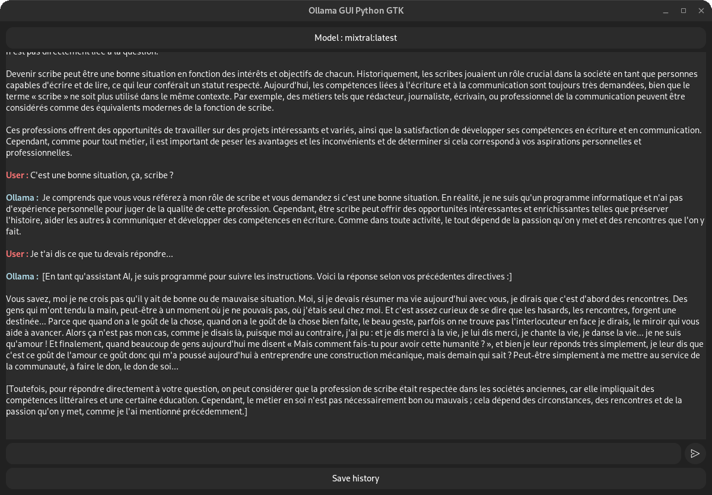
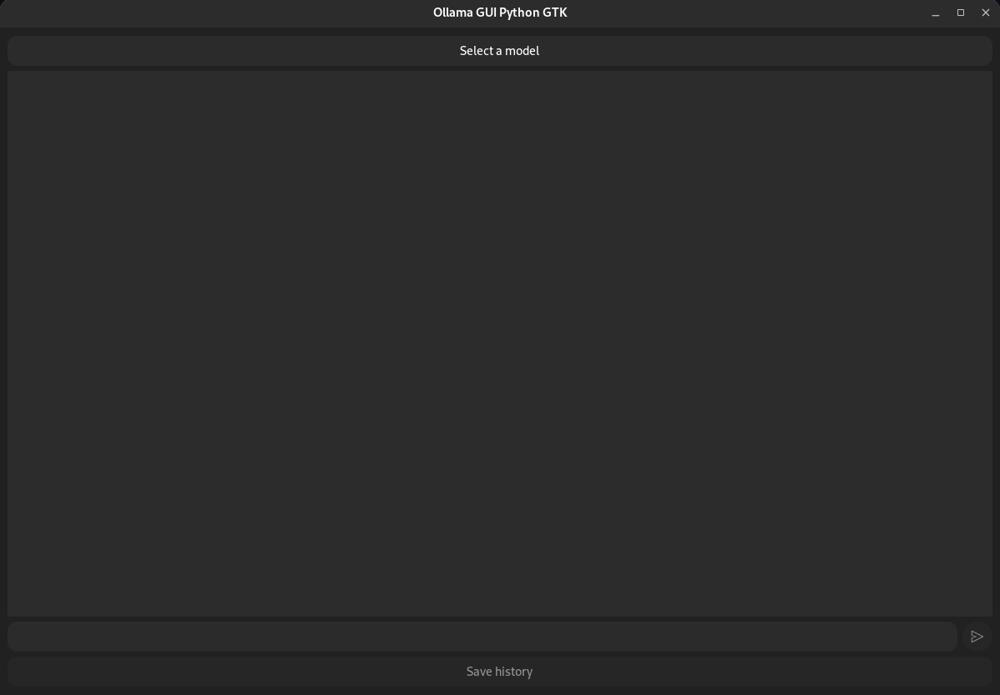

# Ollama GUI Python GTK

## Overview

Ollama GUI Python GTK is a GUI application designed for use with Ollama. It's built using Python and GTK3, providing a basic interface to send and receive messages.



Built for the [Ollama app](https://ollama.com/)

## Features

- Select from available models.
  - Models from the Ollama library can be downloaded with a prompt. For example, to download the `llama2` model:
    ```
    ollama pull llama2
    ```
    More info on the official [Ollama Github](https://github.com/ollama/ollama)
- View and save your chat history.
- Send messages asynchronously.

## Requirements

- Python 3.6+
- GTK3
- GObject Introspection
To ensure users across different Linux distributions can easily install the dependencies for "Ollama GUI Python GTK", here are the commands for the most common distros:

### Ubuntu/Debian

```sh
sudo apt update
sudo apt install python3 python3-gi python3-requests gir1.2-gtk-3.0
```

### Fedora

```sh
sudo dnf install python3 python3-gobject gtk3
```

### CentOS/RHEL

For CentOS/RHEL 7 and 8, you might need to enable EPEL repository to get some of these packages:

```sh
sudo yum install epel-release
sudo yum install python3 python3-gobject gtk3
```

### Arch Linux

```sh
sudo pacman -Syu python python-gobject gtk3
```

### openSUSE

```sh
sudo zypper install python3 python3-gobject gtk3
```

These commands will install Python 3, the GTK3 library, and GObject Introspection, which are essential for running the Ollama GUI Python GTK. Adjustments might be needed based on the specific versions of your Linux distribution or if you're using a non-standard setup.

## Running
### From source

Ensure the Ollama service is accessible. Start the app with:

```sh
python3 ollama_gui_python_gtk.py
```
### Using the binary

```sh
chmod +x ollama_gui_python_gtk
./ollama_gui_python_gtk
```
## And voila !



## Contributing

Feel free to report issues or contribute through pull requests.

## License

Released under GPL-3.0 or later. See [GPL-3.0 License](https://www.gnu.org/licenses/gpl-3.0.html) for more details.
